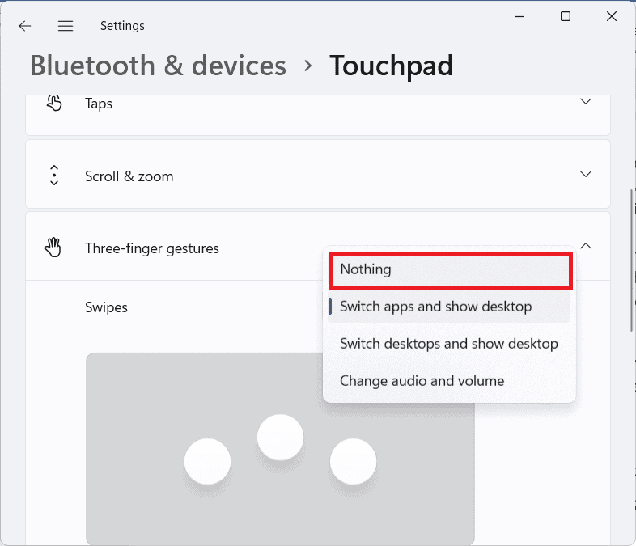
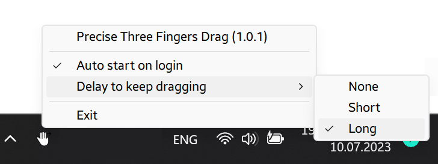

# Precise Three Fingers Drag

This utility allows to drag anything with three fingers. Works only on Precision Touchpads (PTP). 

### How to install
1. Go to [releases](https://github.com/klkvsk/precise-three-fingers-drag/releases/) to download the latest version

  
2. (!) Disable three finger gestures in Windows Settings, because it will interfere with dragging.
 

3. Unpack and run PreciseThreeFingerDrag.exe

4. Right-click on  icon in notification area for options.

